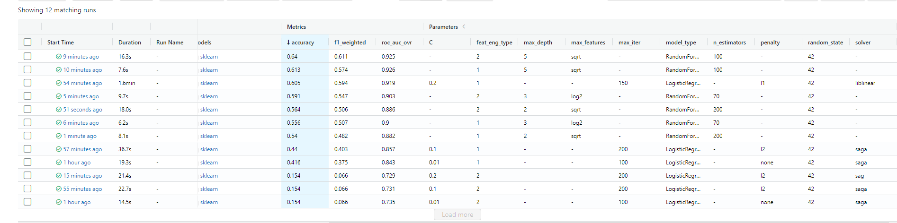

# rsschool-ml-capstone-project

Screenshot for #8: 12 experiments recorded by mlflow using
3 hyperparameters sets, 2 feature engineering techniques,
and 2 machine learning models.

Information for #7: In the commit named (73f16a3bab7c4a2a9c3ef29d4deb62c3f5e6fa26) or (Feat: run 12 experiments with diff models, hyperparameters and feature engineering and track tham with mlflow
) you can see that I implemented k fold cross validation using cross_validate().

# Development

## Using black

poetry add --dev black

**To format scripts in src (development scripts)**

poetry run black src

**To check whether code in src folder meets black requirements**

poetry run black --check src

**To format scripts in tests folder (tests scripts)**

poetry run black tests

**To check whether code in tests folder meets black requirements**

poetry run black --check tests

Black will automatically format your code.
## Using flake8

To underline, I have a .flake8 file in which I specify that my max length of line is 88 symbols
because I ran into conflicts between black and flake8 (flake8 would tell me that line is too long
but when I put arguments of the function that exceeded the line limit on the new line black
would tell me that it is not good)

**Download flake8**

poetry add --dev flake8

**Use flake8 / see what errors you have**

poetry run flake8

After that you will have to fix the mistakes with your hands. You will see an empty output
if there is nothing to fix.

## Using mypy

poetry add --dev mypy

